Use these paths when a customer asks "where did this posting go?" or "why is this document stuck?"

Edges below are derived from live foreign keys on project `linqdstukqayvducxguc`. Soft links (`source_type`/`source_id`, `journal_entry_code`) are noted separately.

## AR order-to-cash

Customer → sales order → fulfillment → AR invoice → payment → journal entry

```mermaid
flowchart LR
  n0["ar_customers"]
  n1["sales_orders"]
  n2["sales_order_lines"]
  n3["fulfillments"]
  n4["fulfillment_lines"]
  n5["ar_invoices"]
  n6["ar_invoice_lines"]
  n7["ar_payments"]
  n8["ar_payment_applications"]
  n9["finance_journalentries_entries"]
  n10["finance_journalentries_lines"]
  n0 -->|"customer_id"| n1
  n1 -->|"sales_order_id"| n2
  n2 --> n3
  n3 -->|"fulfillment_id"| n4
  n4 --> n5
  n5 -->|"invoice_id"| n6
  n6 --> n7
  n7 -->|"payment_id"| n8
  n8 --> n9
  n9 -->|"entry_id"| n10
```

### Key FK joins

| From | Column | To |
| --- | --- | --- |
| `sales_orders` | `customer_id` | `ar_customers` |
| `sales_order_lines` | `sales_order_id` | `sales_orders` |
| `fulfillments` | `invoice_id` | `ar_invoices` |
| `fulfillments` | `journal_entry_id` | `finance_journalentries_entries` |
| `fulfillments` | `sales_order_id` | `sales_orders` |
| `fulfillment_lines` | `fulfillment_id` | `fulfillments` |
| `fulfillment_lines` | `sales_order_line_id` | `sales_order_lines` |
| `ar_invoices` | `customer_id` | `ar_customers` |
| `ar_invoices` | `original_invoice_id` | `ar_invoices` |
| `ar_invoices` | `sales_order_id` | `sales_orders` |
| `ar_invoices` | `shipment_id` | `fulfillments` |
| `ar_invoice_lines` | `invoice_id` | `ar_invoices` |
| `ar_invoice_lines` | `sales_order_line_id` | `sales_order_lines` |
| `ar_invoice_lines` | `source_line_id` | `ar_invoice_lines` |
| `ar_payments` | `customer_id` | `ar_customers` |
| `ar_payments` | `sales_order_id` | `sales_orders` |
| `ar_payment_applications` | `invoice_id` | `ar_invoices` |
| `ar_payment_applications` | `payment_id` | `ar_payments` |
| `finance_journalentries_lines` | `entry_id` | `finance_journalentries_entries` |

## AP procure-to-pay

Supplier → purchase order → receipt → AP bill → payment → journal entry

```mermaid
flowchart LR
  n0["ap_suppliers"]
  n1["ap_purchase_orders"]
  n2["ap_purchase_order_lines"]
  n3["ap_receipts"]
  n4["ap_receipt_lines"]
  n5["ap_bills"]
  n6["ap_bills_lines"]
  n7["ap_payments"]
  n8["ap_payment_applications"]
  n9["finance_journalentries_entries"]
  n0 -->|"supplier_id"| n1
  n1 -->|"po_order_id"| n2
  n2 --> n3
  n3 -->|"receipt_id"| n4
  n4 --> n5
  n5 -->|"bill_id"| n6
  n6 --> n7
  n7 -->|"payment_id"| n8
  n8 --> n9
```

### Key FK joins

| From | Column | To |
| --- | --- | --- |
| `ap_purchase_orders` | `supplier_id` | `ap_suppliers` |
| `ap_purchase_order_lines` | `po_order_id` | `ap_purchase_orders` |
| `ap_receipts` | `po_order_id` | `ap_purchase_orders` |
| `ap_receipts` | `supplier_id` | `ap_suppliers` |
| `ap_receipt_lines` | `po_line_id` | `ap_purchase_order_lines` |
| `ap_receipt_lines` | `receipt_id` | `ap_receipts` |
| `ap_bills` | `original_bill_id` | `ap_bills` |
| `ap_bills` | `supplier_id` | `ap_suppliers` |
| `ap_bills_lines` | `bill_id` | `ap_bills` |
| `ap_payments` | `supplier_id` | `ap_suppliers` |
| `ap_payment_applications` | `bill_id` | `ap_bills` |
| `ap_payment_applications` | `payment_id` | `ap_payments` |

## Bank reconciliation

Plaid item → account → transaction → finance bank txn → link → journal

```mermaid
flowchart LR
  n0["plaid_items"]
  n1["plaid_accounts"]
  n2["plaid_transactions"]
  n3["finance_bank_accounts"]
  n4["finance_bank_transactions"]
  n5["finance_bank_transaction_links"]
  n6["finance_journalentries_entries"]
  n0 -->|"plaid_item_uuid"| n1
  n1 -->|"plaid_account_uuid"| n2
  n2 --> n3
  n3 -->|"bank_account_id"| n4
  n4 -->|"bank_transaction_id"| n5
  n5 -->|"journal_entry_id (rev)"| n6
```

### Key FK joins

| From | Column | To |
| --- | --- | --- |
| `plaid_accounts` | `plaid_item_uuid` | `plaid_items` |
| `plaid_transactions` | `plaid_account_uuid` | `plaid_accounts` |
| `finance_bank_accounts` | `plaid_account_id` | `plaid_accounts` |
| `finance_bank_transactions` | `bank_account_id` | `finance_bank_accounts` |
| `finance_bank_transaction_links` | `bank_transaction_id` | `finance_bank_transactions` |
| `finance_bank_transaction_links` | `journal_entry_id` | `finance_journalentries_entries` |

## Inventory movement

Item → warehouse/bin → inventory transaction → allocations / counts

```mermaid
flowchart LR
  n0["items"]
  n1["warehouses"]
  n2["warehouse_bins"]
  n3["inventory_transactions"]
  n4["inventory_transaction_allocations"]
  n5["inventory_counts"]
  n6["inventory_count_lines"]
  n7["fulfillment_line_bin_allocations"]
  n0 --> n1
  n1 -->|"warehouse_id"| n2
  n2 --> n3
  n3 -->|"inventory_transaction_id"| n4
  n4 --> n5
  n5 -->|"count_id"| n6
  n6 --> n7
```

### Key FK joins

| From | Column | To |
| --- | --- | --- |
| `warehouse_bins` | `warehouse_id` | `warehouses` |
| `inventory_transactions` | `item_id` | `items` |
| `inventory_transactions` | `warehouse_id` | `warehouses` |
| `inventory_transaction_allocations` | `inventory_transaction_id` | `inventory_transactions` |
| `inventory_transaction_allocations` | `item_id` | `items` |
| `inventory_transaction_allocations` | `warehouse_bin_id` | `warehouse_bins` |
| `inventory_transaction_allocations` | `warehouse_id` | `warehouses` |
| `inventory_counts` | `warehouse_id` | `warehouses` |
| `inventory_count_lines` | `count_id` | `inventory_counts` |
| `inventory_count_lines` | `item_id` | `items` |
| `inventory_count_lines` | `warehouse_bin_id` | `warehouse_bins` |
| `fulfillment_line_bin_allocations` | `warehouse_bin_id` | `warehouse_bins` |

## Cart and shipping integrations

Data connection → cart settings/exceptions → sales order; carrier → shipment

```mermaid
flowchart LR
  n0["data_connections"]
  n1["cart_integration_settings"]
  n2["cart_channel_maps"]
  n3["cart_ingest_exceptions"]
  n4["sales_orders"]
  n5["trackstar_inventory_sync_outbox"]
  n6["carrier_connections"]
  n7["shipments"]
  n8["webhook_events"]
  n0 -->|"data_connection_id"| n1
  n1 --> n2
  n2 --> n3
  n3 --> n4
  n4 -->|"sales_order_id"| n5
  n5 --> n6
  n6 --> n7
  n7 --> n8
```

### Key FK joins

| From | Column | To |
| --- | --- | --- |
| `cart_integration_settings` | `data_connection_id` | `data_connections` |
| `cart_channel_maps` | `data_connection_id` | `data_connections` |
| `cart_ingest_exceptions` | `data_connection_id` | `data_connections` |
| `cart_ingest_exceptions` | `webhook_event_id` | `webhook_events` |
| `trackstar_inventory_sync_outbox` | `sales_order_id` | `sales_orders` |
| `shipments` | `sales_order_id` | `sales_orders` |

## Soft links (no FK)

These relationships appear in the live schema as plain columns without foreign keys:

| Pattern | Where | Meaning |
| --- | --- | --- |
| `journal_entry_code` | `ar_invoices`, `ap_bills`, `ar_payments`, `ap_payments`, fulfillments | Points at `finance_journalentries_entries.entry_code` |
| `source_type` + `source_id` | `finance_journalentries_entries`, `inventory_transactions` | Polymorphic origin document |
| `external_id` | Orders, invoices, items, warehouses | Upstream channel / WMS identity |
| `access_token_ref` | `data_connections` | Vault secret reference (never log the secret) |

