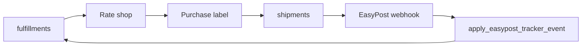

## What it does

EasyPost provides carrier rating/labels and tracking. adorabl stores per-org carrier connections and webhook identity, and can accrue freight at ship.

## Live objects

| Table / column | Purpose |
| --- | --- |
| `organizations.easypost_webhook_id` | Webhook binding for the org |
| `organizations.easypost_account_key_secret_id` | Vault reference for BYO key — **do not read secret** |
| `carrier_connections` | Carrier account rows (`easypost_carrier_account_id`) |
| `shipments` | Purchased shipment/label records |
| `fulfillment_packages` / `fulfillment_boxes` | Package structure |
| `fulfillments.tracking_number` / `carrier_reference` | Tracking mirrors |
| `webhook_events` | Inbound EasyPost events |

RPCs of interest (names from live DB): `get_easypost_account_key`, `get_easypost_account_key_for_organization`, `apply_easypost_tracker_event`, `apply_easypost_refund_event`, `claim_shipment_purchase*`, `post_fulfillment_freight_accruals`.

## Healthy path

## Failure modes

| Symptom | Check | Action |
| --- | --- | --- |
| Cannot buy label | `carrier_connections.status`, org secret presence | Reconnect carrier / BYO account |
| Tracking not updating | `easypost_webhook_id`, `webhook_events` | Rebind webhook; replay event if safe |
| Freight JE missing | Fulfillment shipped + freight accrue settings | Inspect freight accrue RPC errors / period gates |
| Void blocked | Settled freight rules | See inventory/GL runbooks; may need engineering |

## Safety

- Never print EasyPost API keys into docs, screenshots, or tickets.
- Confirm webhook ownership per organization before replaying events.
