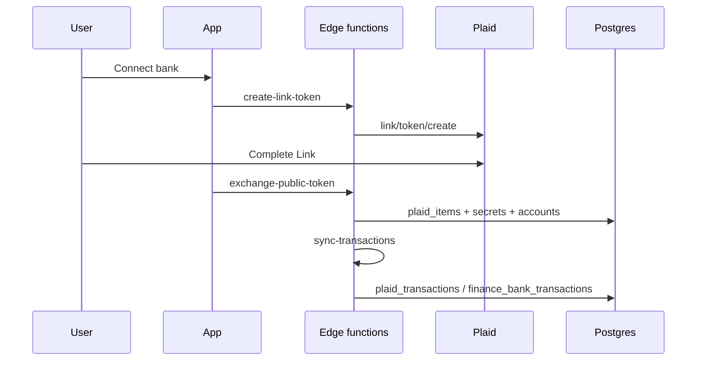

## What it does

Plaid connects organization bank/credit accounts, syncs transactions into Sherpa bank reconciliation, and optionally surfaces statements and credit liabilities.

## Live objects

| Table | Purpose |
| --- | --- |
| `plaid_items` | Institution connection; status drives user re-auth |
| `plaid_item_secrets` | Access token storage — **do not query into tickets** |
| `plaid_accounts` | Accounts under an item |
| `plaid_transactions` | Synced transactions |
| `plaid_statements` | Statement metadata |
| `plaid_liabilities_credit` | Credit liability snapshots |
| `plaid_sync_log` | Sync attempts |
| `plaid_webhook_keys` | Webhook key material |

`plaid_items.status`: `active` · `login_required` · `error` · `disconnected`

## Edge functions

| Function | Use |
| --- | --- |
| `plaid-create-link-token` | Initial Link |
| `plaid-create-update-link-token` | Re-auth Link |
| `plaid-exchange-public-token` | Persist item after Link |
| `plaid-handle-update-success` | Complete update mode |
| `plaid-sync-transactions` | Pull transactions |
| `plaid-sync-liabilities` | Pull liabilities |
| `plaid-webhook` | Inbound Plaid webhooks |
| `plaid-list-statements` / `plaid-download-statement` / `plaid-refresh-statements` | Statements |
| `plaid-disconnect-item` | Disconnect |
| `sync-bank-accounts` / `sync-bank-transactions` | Bridge into finance bank tables |

## Healthy path

## Failure modes

| Symptom | Check | Action |
| --- | --- | --- |
| Login required | `plaid_items.status` | Update Link flow |
| Sync stale | `last_sync_at`, `plaid_sync_log` | Trigger sync; inspect errors |
| Accounts missing in recon | `finance_bank_accounts` mapping | Map GL cash account |
| Webhook ignored | Function logs + item id | Confirm webhook config; never log secrets |

## Safety

- Do not select token columns from `plaid_item_secrets`.
- Do not reset `transactions_cursor` without engineering approval.
