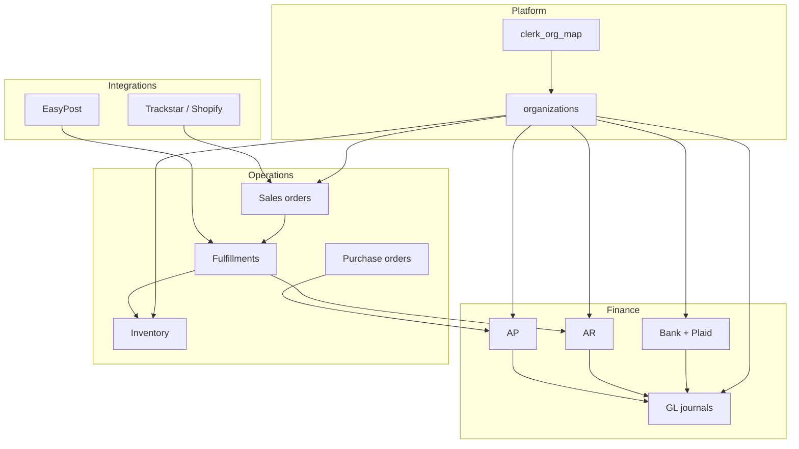

Sherpa is Stellar One's multi-tenant ERP for mid-market operators. It covers finance (AR, AP, GL, bank reconciliation), inventory and warehouses, sales order fulfillment, and commerce/carrier integrations.

## Who you help

| Persona | Typical asks |
| --- | --- |
| Controller / accountant | Period close blockers, JE mismatches, bank rec stuck items |
| AP clerk | Bill posting failures, payment application, W-9 / 1099 |
| AR clerk | Invoice status, payment apply, dunning, credit memos |
| Warehouse / ops | Bin qty, pick/pack/ship, inventory count variance |
| Admin / IT | Plaid reconnect, Shopify/Trackstar sync, EasyPost labels |

## Product map

## Tenancy model

- Every operational row is scoped by `organization_id`.
- Clerk orgs map to Sherpa orgs through `clerk_org_map`.
- RLS and `SECURITY DEFINER` RPCs enforce org guards — do not bypass them from the client.
- Edge functions often accept org context from authenticated Clerk claims.

## Environments

| Layer | Where to look |
| --- | --- |
| App UI | Deployed Sherpa frontend (Clerk-authenticated) |
| Database | Supabase project `linqdstukqayvducxguc` |
| Edge functions | Supabase Functions (Plaid, bank rec, AR pay links, DocuSign, etc.) |
| Secrets | Supabase Vault references — never read raw values into tickets |

## Ticket triage checklist

<Steps>
  <Step title="Identify the org">
    Confirm Clerk org / Sherpa `organizations.id` / slug before querying.
  </Step>
  <Step title="Classify the domain">
    Bank, AP, AR, GL, inventory, or integrations — open the matching runbook.
  </Step>
  <Step title="Capture document identifiers">
    Invoice number, bill number, payment number, JE `entry_code`, external order id, tracking number.
  </Step>
  <Step title="Check period and status">
    Fiscal period module flags and document status often explain "cannot post/void" errors.
  </Step>
  <Step title="Trace, then act">
    Follow the [transaction traces](/data-model/transaction-traces) before mutating data.
  </Step>
</Steps>

## Related pages

- [Terminology](/orientation/terminology)
- [Support intake](/support/intake)
- [Data model overview](/data-model/overview)
