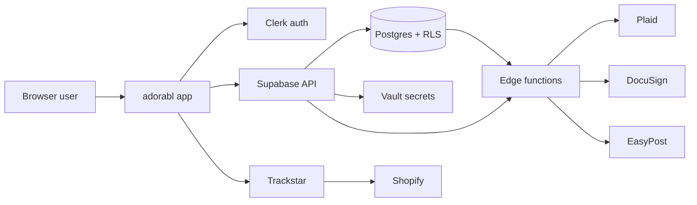

## Architecture at a glance

## Supabase project

| Field | Value |
| --- | --- |
| Name | `sherpa` |
| Project id | `linqdstukqayvducxguc` |
| Region | `us-east-2` |
| Primary schema | `public` |

## Edge function groups (support-relevant)

| Group | Examples | Domain |
| --- | --- | --- |
| Plaid | `plaid-create-link-token`, `plaid-exchange-public-token`, `plaid-sync-transactions`, `plaid-webhook` | Bank |
| Bank rec | `suggest-bank-matches`, `confirm-match`, `categorize-transaction`, `apply-payment`, `unreconcile-transaction` | Bank |
| AR | `ar-dunning-run`, `ar-generate-pay-link`, `ar-public-pay`, `recurring-materialize-run` | AR |
| Compliance | `docusign-send-w9`, `docusign-connect-webhook`, `positive-pay-issue` | AP |
| Identity probe | `clerk-echo` | Platform |

## Secret handling

| Kind | Storage | Support rule |
| --- | --- | --- |
| Plaid access tokens | `plaid_item_secrets` / vault | Never select into tickets |
| Trackstar API keys | Vault via data connection refs | Use `get_trackstar_api_key` only in approved tooling |
| EasyPost account keys | Org vault secret id on `organizations` | Diagnose via status fields, not key values |
| Data connection tokens | `data_connections.access_token_ref` | Reference the ref id only |

## Source repo

Application and function source: [stellarone/sherpa-e9c75a24](https://github.com/stellarone/sherpa-e9c75a24).

When UI behavior and DB state disagree, prefer:

1. Live DB row + status
2. Edge function logs for the org/time window
3. App code paths in the source repo
